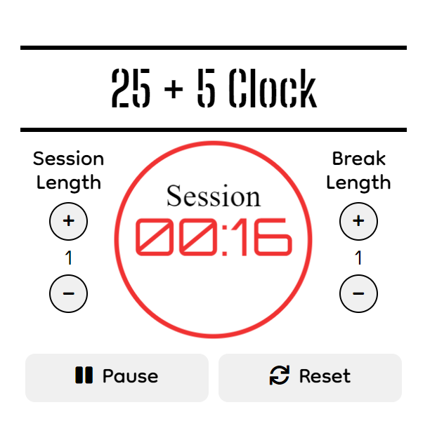

# 25 + 5 Clock
 A simple clock page that sets session timers for both a session and break, allows individual custom legth for each session, also plays a sound when a session ends, made for FreeCodeCamp certification Project using HTML, CSS, JavaScript and atleast one front-end framework (React, Redux,  Bootstrap, jQuery and/or SASS)

## Usage
 Open the index.html file using a browser to open the app.
 Set-Up the session length by increasing or decreasing the session length number with +/- button, then do the same thing for the break legnth session
 Click Start button to start the session timmer.
 When the timer reaches 0, an alarm sound will play immediately and the session will be automatically changed between session and break sessions, the timer will reset to the session's default length and will continue to alternate between the two sessions, you can pause/continue the session or reset to stop the session and reset back to default session values

## Testing
 this project was made using **react** and to test the if the site fulfils all the requirements, you can run the ***test suite*** at the top left and select **25 + 5 Clock** from the dropdown menu and press the *run tests* button, view the results by clicking the button below it which shows how many tests were run.

## Page Preview
 **View/Use this app on Code Pen:** [Drum Machine Live](https://codepen.io/PHULUSO-SINGO/full/WbeMjbx).

 